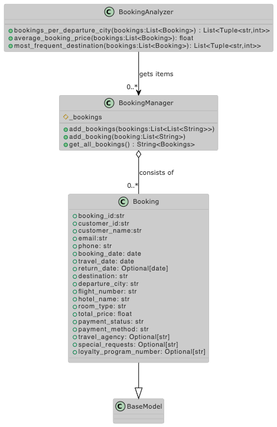

# Challenge 01 -- Manual File Parsing and Basic Data Aggregation

## The Challenge

- Write a Python script to **manually parse a CSV file** (without using external libraries like `pandas`) containing booking information and calculate metrics such as total bookings per city, average booking price, and most frequent destination.
- Tests foundational Python skills (file I/O, string manipulation, and basic data structures)

## The UML Diagram

Booking Class relations

## The Solution

spread out here and there:
- [csvParser](../app/controller/parser.py)
- [booking-class](../app/model/booking.py)
- [test generator](../test/generateBookingData.py)
- [main](../main.py) to run stuff
