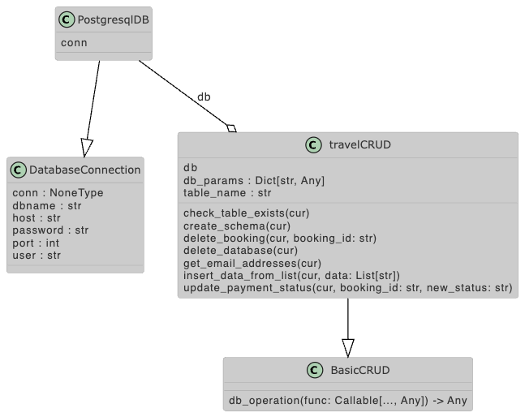

# Challenge 03 -- Basic CRUD Application without Frameworks

## The Challenge

- Build a **basic CRUD (Create, Read, Update, Delete) system** to manage travel bookings using **PostgreSQL**. You’ll interact directly with PostgreSQL by writing raw SQL queries without using any ORM frameworks.
- Use Python’s built-in `psycopg2` library to:
    - Establish connections to the PostgreSQL database.
    - Execute **raw SQL queries** for managing bookings.
    - Ensure transactional consistency using manual `BEGIN`, `COMMIT`, and `ROLLBACK` SQL commands.
- Demonstrate manual handling of database connections, query execution, and safe use of transactions, especially focusing on:
    - Preventing SQL injection.
    - Managing **concurrent transactions** and dealing with potential issues like deadlocks.

## The UML Diagram



## The Solution

### Setting up PostgreSQL Server

Setup basic postgresql server using [Docker-Compose script (check for latest version!)](../app/model/docker-compose.yml) as shown below. Run via `docker-compose -f docker-compose.yaml up`.

```docker-compose
version: '3.8'

services:
  postgres:
    image: postgres:15
    container_name: postgres_sqlalchemy_playground
    environment:
      POSTGRES_USER: admin
      POSTGRES_PASSWORD: mypassword
      POSTGRES_DB: sqlalchemy1
    ports:
      - "5432:5432"
    volumes:
      - postgres_data:/my/path/to/customHTTPserver/postgresDB/data
    networks:
      - postgresql_network
  pgadmin:
    image: elestio/pgadmin
    environment:
      PGADMIN_DEFAULT_EMAIL: admin@mydomain.com
      PGADMIN_DEFAULT_PASSWORD: admin
    ports: 
      - "5050:80"
    depends_on:
      - postgres
    networks:
      - postgresql_network
    volumes:
      - pgadmin_data:/my/path/to/customHTTPserver/postgresDB/pgadmin_data
      - ./servers.json:/pgadmin4/servers.json

volumes:
  postgres_data:
  pgadmin_data:

networks:
  postgresql_network:
```

### Class Design

1. DatabaseConnection Class (Context Manager)
    - The DatabaseConnection class is designed as a context manager using Python’s __enter__ and __exit__ methods. This handles database connections and ensures that:
    - Transactions are committed when no exception occurs.
    - Rollbacks happen when an exception occurs.
    - The connection is always closed properly.
2. CRUD Class
    - The CRUD class encapsulates all the operations for interacting with the database.
    - Single Responsibility Principle: Each method of the class handles only one operation (create schema, insert data, fetch, update, delete).
    - Flexibility: The class is designed to allow easy modifications (e.g., adding more tables, operations).
    - Clean-style: using `db_operation`-decorator from BasicCRUD to achieve DRY as good as possible
3. Separation of Queries from main.py
    - main.py is responsible for handling the application logic, such as calling the appropriate CRUD methods.
    - This ensures the Separation of Concerns—queries and database operations are abstracted into the CRUD class, leaving main.py to handle high-level application flow.

### Improvements

Right now: blocking design and connections are opened/closed for every transaction. In future, rather ...

- use `psycopg2`'s inherent pooling possibilities
- directly use `psycopg2` inherent transaction wrapping
- fix drop-table behaviour -> really working?

### Side Notes

1. Created the basic plantUML diagram from the written [database module](../app/model/database.py) using `pylint` package and running `pyreverse app/model/database.py -p 03-database -d ./documentation/uml -o puml` and then correcting several entries
2. Added the [environment.yml](../environment.yml) using the command `mamba env export --no-builds | grep -v "^prefix: " > environment.yml`. 