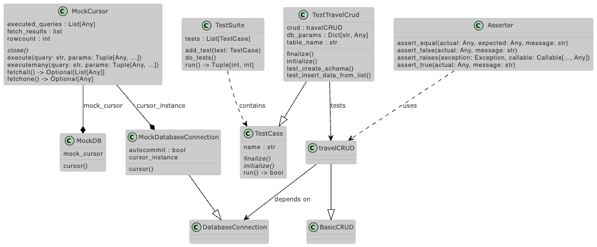

# Challenge 04 -- Custom Unit Testing Framework

## The Challenge

- Implement your own **basic unit testing framework** from scratch, mimicking some functionality of `unittest` or `pytest`. Then, use it to test your CRUD application.
- This will demonstrate your deep understanding of testing concepts and building tools from the ground up.

## The UML Diagram

## The Solution

Basic idea

- have a general `TestSuite` that holds a list of method-objects of a child-class of `TestCase`-class to be tested
- `TestCase` does an `initialize` and `finalize` at beginning and end to setup and release eventually relevant database configurations etc for each test individually (to thoroughly test whole setup)
- `TestTravelCrud` class holds `test_` prefixed versions of the original functions from `TravelCrud` class to test the behaviour

Tricky points

- How to access the used queries after the cursor is deleted and memory reallocated given the use of the context manager for consistent transactioning?
    - implemented a history mode into the context wrapper `@BasicCRUD.db_operation`

Note

- Only implemented the test for 1 of the 7 `travelCRUD` classes to demonstrate the approach.

Files

- [test/unit_test_framework.py](../test/unit_test_framework.py)
- [test/test_database.py](../test/test_database.py)
- updated [database.py](../test/database.py)