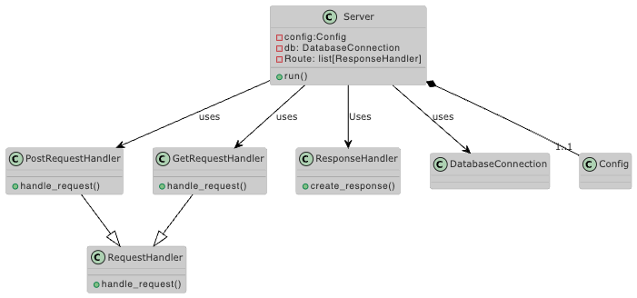
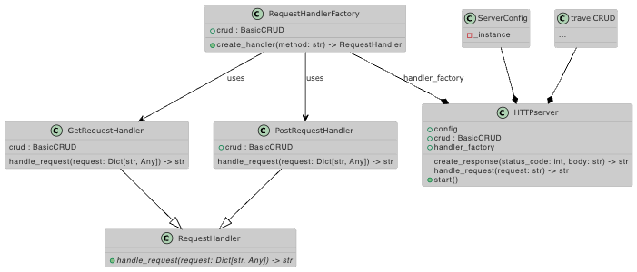

# Challenge 05 -- Custom HTTP Server

## The Challenge

- Build a minimalistic **HTTP server** from scratch using Python’s `socket` module. The server should handle basic requests like `GET` and `POST` for managing travel bookings, and respond with custom HTML or JSON data.
- Avoid using libraries like `Flask` or `FastAPI`. This task tests your ability to implement networking protocols, manage socket connections, and handle HTTP responses manually

## The UML Diagram

Server v1 (before the coding)

Server v2 (autogenerated after coding)

## The Solution

### Implementing a synchronized simple HTTP Server

Rough steps-outline

1. **Overview**
   1. first get overview about standard HTTP [request methods](https://en.wikipedia.org/wiki/HTTP#Request_methods), [header](https://en.wikipedia.org/wiki/List_of_HTTP_header_fields) fields and [response codes](https://en.wikipedia.org/wiki/List_of_HTTP_status_codes)
   2. resulted in reading into [Request for Comments (RFC) 9110](https://datatracker.ietf.org/doc/html/rfc9110) declaration
   3. create UMLv1 for a synchronized version and get started
   4. understand that I am actually building a low-level version of an API
   5. define data-structures and main fields to be used -> eg shape of external HTTP-request
2. **Code**
   1. realize that provided interface classes by travelCRUD are way to specific
   2. I am indeed writing an API
   3. make sure that **SQL-code-injection** is avoided by using conform SQL-queries = no direct parameter-injection in python using outside parameters
3. **Improvement**
   1. Make Async

In the final code the following OOP design patterns and best practices are included:

1. **Strategy Pattern**: Used for handling different types of HTTP requests (GET and POST) with the `RequestHandler` abstract base class and its concrete implementations.
2. **Factory Pattern**: Implemented in the `RequestHandlerFactory` class to create appropriate request handlers based on the HTTP method.
3. **Singleton Pattern**: Used for the `ServerConfig` class to ensure only one instance of server configuration exists.
4. **Dependency Injection**: The `travelCRUD` instance is injected into the `HTTPServer` class, allowing for easier testing and flexibility.
5. **Single Responsibility Principle**: Each class has a single, well-defined responsibility.
6. **Open/Closed Principle**: The server can be extended to handle new HTTP methods without modifying existing code, by adding new request handlers.
7. **Error Handling**: Proper error handling and response creation for different scenarios.
8. **Type Hinting**: Used throughout the code to improve readability and catch potential type-related errors.
