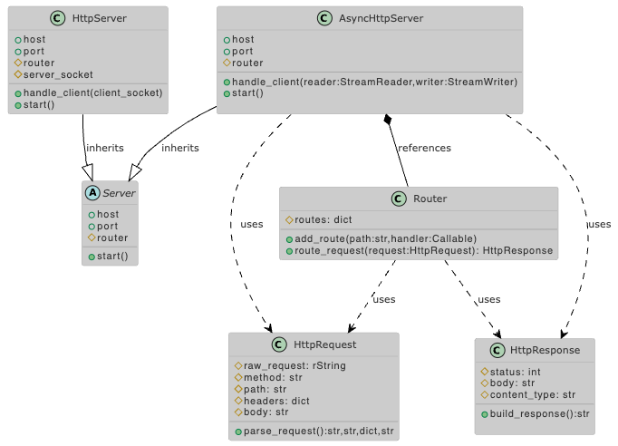

# Challenge 05 -- Custom HTTP Server

## The Challenge

- Build a minimalistic **HTTP server** from scratch using Python’s `socket` module. The server should handle basic requests like `GET` and `POST` for managing travel bookings, and respond with custom HTML or JSON data.
- Avoid using libraries like `Flask` or `FastAPI`. This task tests your ability to implement networking protocols, manage socket connections, and handle HTTP responses manually

## The UML Diagram

## The Solution

???
