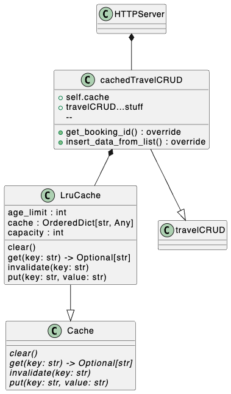

# Challenge 06 -- Manual Data Caching

## The Challenge

- Implement a custom **in-memory caching system** for the booking data. This cache should store frequently accessed data (e.g., top destinations), with a manual **cache invalidation policy** when new bookings are made.
- Focuses on performance optimizations and requires careful thought about memory management, cache eviction strategies, and data consistency.

## The UML Diagram

## The Solution

### Files Touched

- add [LruCache](../app/model/cache.py)
- added [cachedTravelCRUD](../app/model/database.py)
- add testcases for [httpClient](../app/controller/httpClient.py)

### Thoughts

First approach

- start with a simple lruCache in pc-memory
    - implement from general Caching-Class and provide via dependency injection during runtime to database
    - test with multi-query using [httpClient](../app/controller/httpClient.py)
    - implement using [OrderedDict](https://docs.python.org/3/library/collections.html#collections.OrderedDict) -> even though not intuitive for me, newest at the end and pop(0) least used seems industry-standard
        - > "To place the important in the right order is to avoid unnecessary complexity." — Zhuangzi 😜

Regarding the cache invalidation and eviction policy:

1. Invalidation Policy:
   - use a "write-through" strategy. When a new booking is added, it's immediately written to the underlying storage (BasicCRUD) and not added to the cache. It will be cached only when it's first requested.
2. Eviction Policy:
   - use an LRU (Least Recently Used) eviction policy. When the cache reaches its capacity, the least recently used item is removed to make space for new entries.
   - This policy is implemented in the LRUCache class using an OrderedDict, which maintains the order of item access.
3. Performance Considerations:
   - The LRU cache provides O(1) time complexity for both get and put operations.
   - By caching frequently accessed data like top destinations, we reduce the load on the underlying storage system.
   - The cache size is configurable, allowing for tuning based on available memory and access patterns.
4. Consistency:
   - For individual bookings, always fetch from the underlying storage if not in the cache, ensuring data consistency.
   - For aggregate data like top destinations, invalidate the cache on writes to maintain eventual consistency.
5. Memory Management:
   - The fixed-size LRU cache prevents unbounded growth of memory usage.
   - By focusing on caching only frequently accessed data, memory usage is optimized.

### Next steps from here

- spin-up a redis-container and use redis-framework to store there and simulate communication latencies
