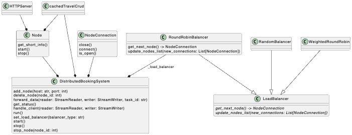

# Challenge 07 -- Manual Distributed System Simulation

## The Challenge

- Design and implement a **simple distributed booking system** using **Python’s `socket` library**. Simulate multiple nodes (instances of your HTTP server) and manually handle the distribution of bookings across these nodes with basic load balancing (round-robin or random).
- This task requires understanding of distributed system concepts without relying on any external libraries or frameworks

## The UML Diagram

## The Solution

### Updated Files

- created new classes `DistributedBookingSystems`, computational `Node` and `NodeConnection` in [distibutedSystem](../app/controller/distibutedSystem.py)
- updated [HttpClient](../app/controller/httpClient.py)-testing slightly 
- update [httpServer](../app/controller/httpServer.py)
- create fancy names for nodes in via [CreativeNamer](../app/controller/names.py) class
    - leading to welcome messages like `Hello. This is serendipitous fantastical Galaxy. Let's go!`
- create [manyClients](../app/controller/manyClients.py) to run multiple httpClients

### Basic Idea

- hardware-abstraction = Node (runs instance of HTTP-server)
- LoadBalancer -> RoundRobin, Random, WeightedRoundRobin -> decides where to send request
- DistributedBookingSystem -> distributes requests among nodes, thus is a relay that combines client socket with node (server) socket
- central DB, connected to by all nodes individually -> concurrency!

### Problems

- it took me quite a while to make asyncio (server-side) and sockets (client side) work properly together as closing the connection on client side is/was a problem for me
- finally introduced a hard waiting time and re-init of a connection on server side --> but: slows down the system response speed -> including the query respone is $<=150ms$ right now, but if a big query or inserting operation is used line `await asyncio.wait_for(asyncio.gather(client_task, node_task), timeout=0.2)` in `DistributedBookingSystem.handle_client(...)` will become a big problem
- when running 10 clients the probability is high that the same node has the same DB-entry/query in its LRUCache, but when checking the cli **all reads are from DB -> why???**
