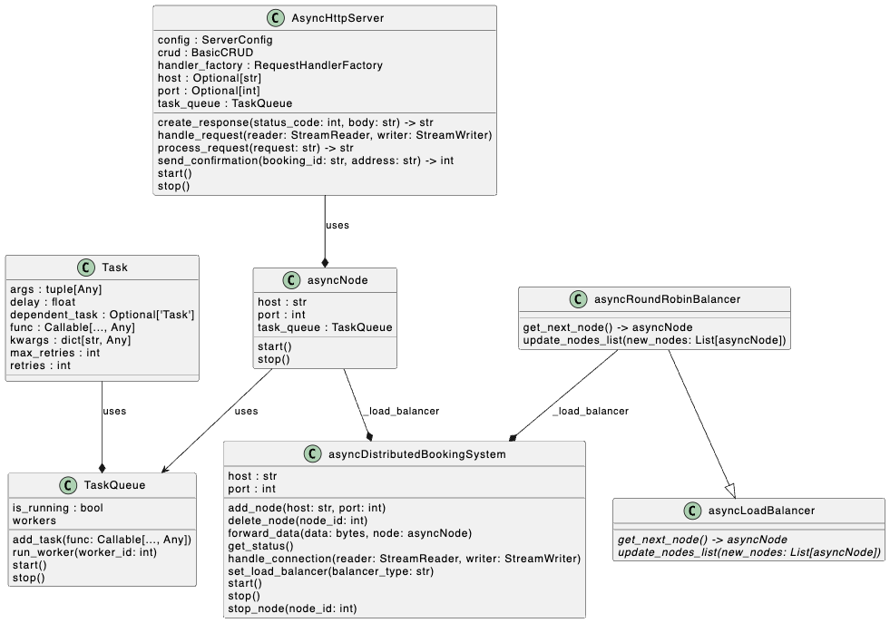

# Challenge 08 -- Custom Asynchronous Task Queue

## The Challenge

- Implement a **custom task queue** using Python’s built-in `queue` module to process bookings asynchronously. Simulate background tasks like sending booking confirmation emails after bookings are completed. The task queue should handle failures and retry logic.
- This tests your understanding of concurrent programming, task scheduling, and message-driven architectures without relying on pre-built solutions like `Celery`.

## The UML Diagram

## The Solution

### Files Changed

- changed the way the distribution system works in [asyncDistributedSystem.py](../app/controller/asyncDistributedSystem.py) -> now without Node-Connection but direct connections
- [asyncHttpServer.py](../app/controller/asyncHttpServer.py)
- [taskQueue.py](../app/controller/taskQueue.py)
- re-basing the cliently completey on `asyncio` and `aiohttp` to get sessions properly closed [asyncHttpClient.py](../app/controller/asynchttpClient.py)
- convenience for testing many async-clients -> [manyAsyncClients.py](../app/controller/manyAsyncClients.py)

### Basic Idea

- Q1: Where is the bottle-neck and which tasks do need to be in a task-queue? 
    - `DistributedBookingSystem`
    - each `Node`
    - but problem: if taskQueue leads to DistributedBookingSystem task need to wait before execution then process could be clodes due to `asyncio.wait_for`-statement around `asyncio.gather` in `DistributedBookingSystem.handle_client`
    - so for now: 1 for DistributedBookingSystem
- On this addition also
    - ✅test caching -> what is in the cache and why is it not re-used -> test with all the same entries.

### Findings

- using `asyncio`-package only, instead of using sockets and asyncio interchangeable,  was such a relief
- making the `tasks` part of `asyncNode` helped with task-chaining
- converting the whole `asyncDistributedBookingSystem` (aDBS) to an `async` function and basing it completely on `asyncio` made management of data-forwarding easier

### Things to do

- test whether the speed and bandwidth of `aDBS` is a limiting factor of the whole system or if the read and write-streams are peer-to-peer only